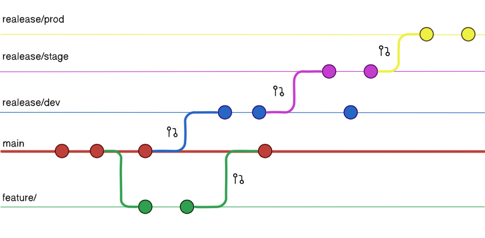

# 🚀 Shipping Large-Scale Software to Production with Automated Multi-Environment Releases

Full blog breakdown 👉 [Read the detailed article here](https://medium.com/@jamiekariuki18/shipping-large-scale-software-to-production-automating-multi-environment-releases-with-ci-cd-24c1e796f31f)

---

## 📌 Project Overview

This project demonstrates how to automate **multi-environment releases** at scale using:

- **Terraform** → to provision AWS infrastructure
- **GitHub Actions** → to automate CI/CD pipelines
- **Semantic Versioning** → to track and manage releases
- **Branching Strategy** → to enforce environment isolation (Dev, Staging, Production)
- **Automatic Rollbacks & Smoke Tests** → to guarantee safer deployments

The goal is to show how disciplined workflows + automation can transform the way software is shipped to production.

---

## 🏗️ Architecture

### 🔹 Infrastructure


Infrastructure is fully provisioned with **Terraform**, using:

- **Workspaces** → to manage different environments (Dev, Staging, Prod)
- **S3 remote backend + DynamoDB** → to handle state locking and prevent conflicts
- **Tags** → to clearly identify resources per environment

Every environment gets its own **VPC** and **EC2 instances**, properly tagged for traceability.

---

### 🔹 CI/CD Pipeline


The pipeline automates the entire release flow:

1. **Pull Requests** → act as checkpoints for promoting changes
2. **Semantic Versioning** → ensures proper version increments (`major.minor.patch`)
3. **Build & Deploy** → builds Docker images, tags them with versions, and pushes to environments
4. **Smoke Tests** → validate deployments before marking success
5. **Automatic Rollbacks** → in case of failure, the pipeline reverts to the last stable version

This guarantees **safe, repeatable, and auditable deployments** across environments.

---

### 🔹 Branching Strategy



Branches are directly tied to environments:

- `dev` → Development environment
- `staging` → Pre-production testing
- `production` → Live environment

We **never use `main` as a release branch**. Instead, pull requests into these environment branches trigger deployments.
This ensures:

- Cleaner history
- Easier debugging
- No accidental production pushes

Pull requests act as **gates**, enforcing review, discipline, and safe promotion of changes.

---

## ⚙️ Running the Project

### 1. Clone the repository

```bash
git clone https://github.com/jamiekariuki/Software-release-and-branching-stratergy.git
cd Software-release-and-branching-stratergy
```

### 2. Setup Terraform Variables

- Create a `terraform.tfvars` file in the infra directory with your values (VPC CIDRs, instance types, etc).
- Configure remote state in S3 and DynamoDB.

Example:

```hcl
aws_region = "us-east-1"
project    = "multi-env-release"
```

### 3. Add Environment Secrets

In your **GitHub repository settings**, add secrets for each environment:

- `AWS_ACCESS_KEY_ID`
- `AWS_SECRET_ACCESS_KEY`
- `AWS_REGION`
- `ECR_REPO` (if using Amazon ECR)

Each branch (`dev`, `staging`, `production`) should have its corresponding secrets.

---

### 4. Follow Commit Conventions

We use **Conventional Commits** to drive semantic versioning.

Examples:

- `feat: add login API` → Increments **minor**
- `fix: correct typo in config` → Increments **patch**
- `BREAKING CHANGE: migrate DB schema` → Increments **major**

⚠️ **Avoid using `latest` tags** or random commit SHAs — every release is traceable via semantic versions + GitHub tags.

---

### 5. Create and Use Environment Branches

- Create branches for each environment:

```bash
git checkout -b dev
git checkout -b staging
git checkout -b production
git push origin release/dev
git push origin release/stage
git push origin release/prod
```

- Work on feature branches → open PRs into `dev` → merge to `staging` → finally `production`.

Each merge automatically triggers the CI/CD pipeline for that environment.

---

## 🌟 Key Takeaways

- Multi-environment automation brings **safety, clarity, and speed** to releases.
- Terraform workspaces + GitHub Actions pipelines = clean infra + clean deployments.
- Branching + semantic versioning isn’t just structure — it’s **release management hygiene**.

---
